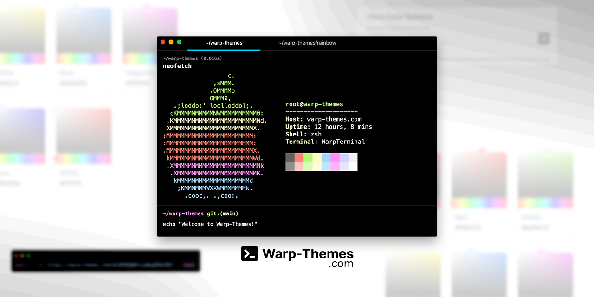
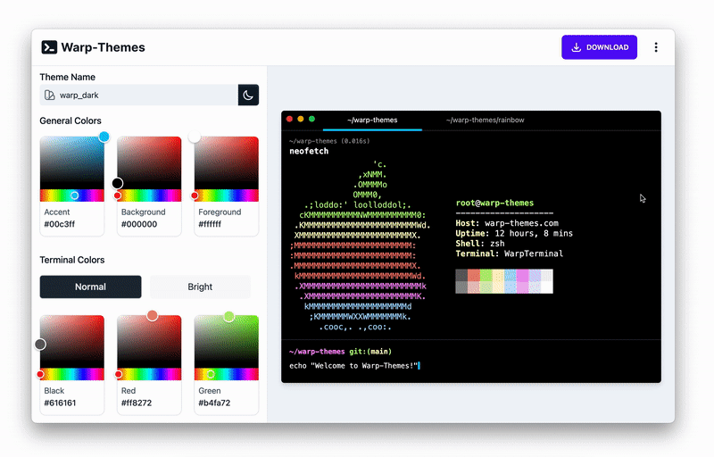
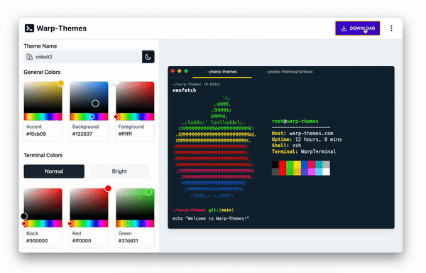

> I'm currently in the process of reworking Warp-Themes and Warp-Companion. Stay tuned for future updates 🎉

 

  
    
  
  <h3>A visual theme builder for <a href="https://warp.dev">Warp</a></h3>
    
  <h3><a href="https://warp-themes.com"><strong>✨ Try it out now ✨</strong></a></h3>
    
   
  <a href="https://github.com/haackt/warp-themes/issues"> 🐛 Report a Bug</a>&nbsp;&nbsp;·&nbsp; 
  <a href="https://github.com/haackt/warp-themes/issues">🚀 Request a Feature</a>
   
  <h4><a href="https://github.com/sponsors/haackt">☕️ Support the Development</a></h4>

## About

Warp-Themes is a visual theme builder for <a href="https://warp.dev">Warp</a>. It's a web-app built with NextJS and hosted on Vercel ▲

## Features

### Easily customize the colors of your theme

Warp-Themes offers you a sidebar, with which you can easily adjust all the colors (and some few more options) of your theme 🎨

### Migrate iTerm Color Schemes to Warp

Does your favorite theme have an iTerm Color Scheme but not a Warp theme? Worry no more. Worry no more. With only a few clicks you can migrate it to Warp 🔮

### Easy installation via the terminal

You can install your newly created theme easily via the terminal. If you're skeptical about running it, just check out the source of the script 🔎 No hidden magic ✨

## Extension

If you're using Visual Studio Code, also try out [**Warp-Companion**](https://github.com/haackt/warp-companion) 🧙🏻‍♂️

## Special Thanks

Special thanks to the awesome team over at [Warp](https://warp.dev/). They not only sponsored the domain ([warp-themes.com](https://warp-themes.com/)) but also gave me feedback and suggestions for improvement, after reaching out to me, after the first time tweeting about the project ✨

## Contact

[@torben_haack](https://twitter.com/torben_haack) – hi@warp-themes.com

(<a href="#readme-top">back to top</a>)

